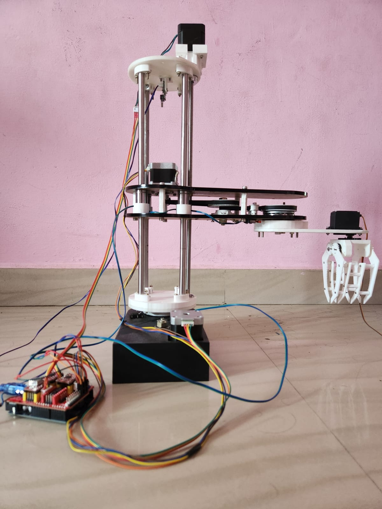
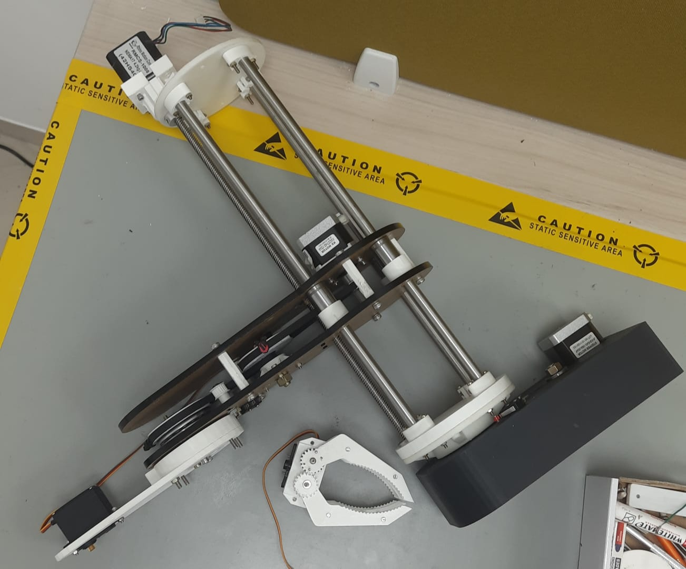

# 🚆 Vision-Based Robotic System for Railway Waste Management

A computer vision guided robotic arm prototype designed to detect and collect non-biodegradable railway waste using Raspberry Pi, OpenCV and YOLO object detection.

---

## 📌 Project Overview

Railway tracks accumulate a large amount of non-biodegradable waste such as plastic bottles, wrappers and disposable containers. Manual cleaning is time-consuming and exposes workers to hazardous conditions.

This project presents a prototype robotic system that uses **Computer Vision** and **Robotics** to automatically detect and pick waste objects.

The system integrates:

- Raspberry Pi 4
- USB Camera
- OpenCV
- YOLO Object Detection
- 3D Printed Robotic Arm
- Servo Motors
- Lead Screw Mechanism

---

# 📷 Project Images

## Final Prototype



---

## CAD Model

### CAD View 1


### CAD View 2


### CAD View 3


---

## Complete CAD Assembly


---

## Prototype Assembly



---

# ⚙ Hardware Used

- Raspberry Pi 4# Vision-Based Robotic System for Railway Waste Management

## Overview

This project presents a vision-based robotic arm prototype developed for automated detection and collection of non-biodegradable waste in railway environments. The system integrates computer vision, robotic manipulation, embedded systems, and mechanical design to demonstrate an automated waste collection solution.

The prototype detects waste objects using a USB camera and computer vision algorithms running on a Raspberry Pi. Once an object is detected, its coordinates are calculated and converted into robotic arm joint angles using inverse kinematics. The robotic arm then moves toward the target and picks it using a gripper mechanism.

Although the prototype is stationary, the overall concept is intended for integration with a railway-compatible mobile platform in future implementations.

---

## Project Highlights

- Computer Vision based waste detection
- Raspberry Pi based image processing
- OpenCV and YOLO object detection
- Forward and Inverse Kinematics
- Custom designed robotic arm
- 3D printed mechanical components
- Belt-driven transmission system
- Servo motor based gripper
- CAD designed in SolidWorks

---

## Hardware

- Raspberry Pi 4
- USB Camera
- Servo Motors
- Lead Screw Mechanism
- Stainless Steel Linear Guide Rods
- 3D Printed PLA Components
- Nickel Cadmium Battery
- Timing Belt & Pulley System

---

## Software

- Python
- OpenCV
- YOLO
- Raspberry Pi OS
- SolidWorks
- Cura

---

## Working Principle

```
USB Camera
      │
      ▼
Image Acquisition
      │
      ▼
OpenCV + YOLO Detection
      │
      ▼
Object Coordinates
      │
      ▼
Inverse Kinematics
      │
      ▼
Joint Angle Calculation
      │
      ▼
Servo Motor Control
      │
      ▼
Robotic Arm Picks Waste
```

---

## Robot Prototype

### CAD Model


---

### Complete CAD Assembly


---

### Prototype Assembly


---

### Final Project


---

## Mechanical Design

The robotic arm was designed in SolidWorks and fabricated using PLA through 3D printing. Motion is achieved using servo motors combined with timing belt reductions, stainless steel guide rods, and a lead screw mechanism for linear movement.

The arm uses forward and inverse kinematics to position the end-effector accurately for waste pickup.

---

## Computer Vision

The computer vision pipeline uses a USB camera connected to a Raspberry Pi.

The captured images are processed using OpenCV, while YOLO performs real-time object detection to identify waste materials such as plastic bottles and packaging.

After detection, the center of the detected object is converted into robot coordinates and passed to the inverse kinematics algorithm for robotic arm motion.

---

## Future Improvements

- Mobile railway platform integration
- ROS 2 implementation
- Depth camera integration
- Improved object classification
- Autonomous navigation
- AI-based waste segregation

---

## Repository Structure

```
vision-based-railway-waste-robot/

├── images/
├── CAD/
├── computer_vision/
├── robot_control/
├── electronics/
├── docs/
└── README.md
```

---

## Author

**Fayis Zain P S**

Mechanical Engineering | Robotics | Computer Vision | AI | ROS

- USB Camera
- Servo Motors
- Lead Screw Mechanism
- Stainless Steel Guide Rods
- PLA 3D Printed Parts
- Nickel Cadmium Battery

---

# 💻 Software Used

- Python
- OpenCV
- YOLOv8
- Raspberry Pi OS
- SolidWorks
- Cura

---

# 🤖 Working Principle

```
Camera
      │
      ▼
Image Acquisition
      │
      ▼
YOLO Object Detection
      │
      ▼
Bounding Box Generation
      │
      ▼
Coordinate Extraction
      │
      ▼
Inverse Kinematics
      │
      ▼
Servo Motor Control
      │
      ▼
Robotic Arm Picks Waste
```

---

# 🦾 Robot Kinematics

The robotic arm uses:

- Forward Kinematics
- Inverse Kinematics

Forward kinematics determines the end-effector position from known joint angles.

Inverse kinematics computes the joint angles required to reach the waste detected by the camera.

---

# 🧠 Computer Vision Pipeline

- Image Capture
- Image Pre-processing
- YOLO Object Detection
- Bounding Box Detection
- Object Coordinate Extraction
- Coordinate Mapping
- Robotic Arm Motion

---

# 📊 Current Project Status

✅ CAD Design Completed

✅ Mechanical Prototype Fabricated

✅ 3D Printed Components Assembled

🔄 Electronic Integration (In Progress)

🔄 Raspberry Pi Integration

🔄 Computer Vision Development

🔄 YOLO Model Training

🔄 Robot Motion Testing

---

# 🚀 Future Improvements

- Mobile Railway Platform
- ROS 2 Integration
- LiDAR / Depth Camera
- Autonomous Navigation
- AI-based Waste Classification
- Cloud Monitoring

---

# 🛠 Technologies

- Python
- OpenCV
- YOLOv8
- Raspberry Pi
- Robotics
- Computer Vision
- SolidWorks
- Mechanical Design
- 3D Printing

---

# 👨‍💻 Team

- Fayis Zain P S
- Bibinraj
- Paul Varghese
- Muhammed Nasim P S

Department of Mechanical Engineering

Model Engineering College

---

# 📄 License

This project is developed for academic and educational purposes.
